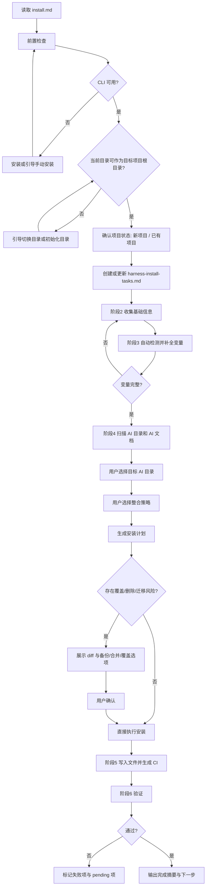

# OpenSpec OPC 安装指南

> 本文档是 OpenSpec OPC 的 AI 执行入口。
> AI 助手必须从本文档开始，按阶段执行安装流程。
> 除非文档明确要求，否则不要跨阶段推断、不要跳步、不要提前修改业务文件。

## 执行规则

1. 阶段 `prerequisite` 到 `stage4` 允许读取、检测、提问、记录，但默认不修改业务文件。
2. 从阶段 `stage1` 结束开始，必须在目标项目根目录创建或更新 `harness-install-tasks.md`；后续所有阶段都以此文件为唯一任务账本。
3. 阶段 `stage5` 才允许执行安装写入，包括复制模板、替换变量、安装依赖、生成 CI/CD 配置。
4. 凡是涉及用户已有资产的操作，必须先获得用户明确确认；不得假设“默认覆盖”。
5. 如果发现信息缺失、变量不完整、检测结果冲突，不要猜测；应回到对应阶段补全并更新 `harness-install-tasks.md`。
6. 默认采用保守安装策略：优先备份、合并、并存安装；只有在用户明确同意时才允许覆盖。
7. 每个阶段只加载对应的 YAML 定义；不要一次性读取所有阶段文件。

## 路径与远程推导规则

如果本文档来自远程仓库，所有关联文件都必须基于“当前文档所在提交或分支的相对路径”推导，不要假设默认分支为 `main`。

| 来源形式 | 推导规则 |
|----------|----------|
| GitHub `blob/<ref>/path` | 转换为 `raw.githubusercontent.com/<owner>/<repo>/<ref>/path` |
| GitHub `tree/<ref>/path` | 保持同一 `<ref>`，按相对路径查找原始文件 |
| 本地文件 | 直接按相对路径访问 |

**示例**
- 本文档 URL：`https://github.com/user/repo/blob/feature-x/openspec-opc/install.md`
- stages YAML：`https://raw.githubusercontent.com/user/repo/feature-x/openspec-opc/install-reference/stages/prerequisite.yaml`
- 模板文件：`https://raw.githubusercontent.com/user/repo/feature-x/openspec-opc/.template/AGENTS.md`

## 文件结构

```text
openspec-opc/
├── install.md                  ← AI 执行入口
├── README.md                   ← 产品介绍
├── install-reference/
│   └── stages/                 ← 各阶段 YAML 定义（按需加载）
│       ├── prerequisite.yaml
│       ├── stage0-init.yaml
│       ├── stage1-status.yaml
│       ├── stage2-collect.yaml
│       ├── stage3-detect.yaml
│       ├── stage4-config.yaml
│       ├── stage5-execute.yaml
│       └── stage6-verify.yaml
└── .template/                  ← 安装模板源
    ├── AGENTS.md               → 目标项目: AGENTS.md
    ├── harness-install-tasks.md → 目标项目: harness-install-tasks.md（先创建工作副本，再持续更新）
    ├── openspec/               → 目标项目: openspec/
    │   ├── config.yaml
    │   └── schemas/
    ├── agent-config/           → 目标项目: {{AI_CONFIG_DIR}}/（动态重命名）
    │   ├── commands/
    │   └── skills/
    ├── ci-templates/           → 目标项目: 根据 CI_TYPE 生成对应配置，并可选安装 pre-commit hook
    └── README.md               ← 模板说明（安装时不复制）
```

## 插件安装边界

当前安装流程会处理的是 OpenSpec OPC 模板和 OpenCode 运行时插件接线：

- 复制 `AGENTS.md`、`openspec/`、`commands/`、`skills/`
- 如果 `AI_TOOL_NAME == opencode`，创建或合并 `.opencode/opencode.json`
- 确保其 `plugin` 数组包含 `@openspec-opc/opencode-plugin`

`.opencode/opencode.json` 的目标格式应为：

```json
{
  "$schema": "https://opencode.ai/config.json",
  "plugin": ["@openspec-opc/opencode-plugin"]
}
```

该文件的字段合法性应以官方 schema `https://opencode.ai/config.json` 为准。安装流程在创建或合并 `.opencode/opencode.json` 时，应遵循该 schema 的字段命名和数据类型约束。

如果目标项目已存在 `.opencode/opencode.json`，应在保留现有合法配置的前提下合并，并确保：

- 顶层字段名是 `plugin`，不是 `plugins`
- `plugin` 的值是数组
- 数组中包含 `@openspec-opc/opencode-plugin`
- `$schema` 使用 `https://opencode.ai/config.json`

当前安装流程**不会**复制旧版 `.opencode/plugins/` 或 `.opencode/vendor/` runtime 文件。

Codex 侧当前仍处于本地插件 scaffold 阶段；仓库里有 `plugins/codex-spec-opc/`，但截至当前版本，它还不是 `install.md` 默认执行的正式安装目标。

## 版本兼容性

| 组件 | 最低版本 | 推荐版本 |
|------|----------|----------|
| **OpenSpec CLI** | 0.1.0 | latest |
| **Node.js** | 18.0.0 | 22.x LTS |
| **Git** | 2.0.0 | latest |

### Windows 中文编码处理

在 Windows 环境下处理文件写入时，必须遵循以下规则：

1. **始终明确指定 UTF-8 编码**
   - Node.js: `fs.writeFile(path, content, { encoding: "utf8" })`
   - Bun: `Bun.write(path, content)` (默认 UTF-8)
   - PowerShell: 使用 `[System.IO.File]::WriteAllText($path, $content, [System.Text.UTF8Encoding]::new($false))`

2. **YAML 结构必须符合 schema 定义**
   - `context` 字段必须是**字符串**，不是对象
   - 避免嵌套对象结构导致 YAML 解析错误
   - 示例正确格式：
     ```yaml
     context: "项目名称: My Project"
     ```
     不是：
     ```yaml
     context:
       project:
         name: "My Project"  # 错误 - 这是对象
     ```

3. **PowerShell 写入时要特别注意**
   - 避免使用 `Set-Content` 默认编码（会使用系统默认而非 UTF-8）
   - 使用 .NET 方法明确指定 UTF-8
   - 或使用 Node.js/Bun 脚本间接写入

4. **检测编码问题的迹象**
   - 中文显示为 `???` 或乱码
   - YAML 解析报错（重复字段、结构错误）
   - 文件中出现 `\"\\n\"` 字面量（换行符未转义）

当检测到文件写入后出现乱码或结构异常时，应立即使用正确的编码方式重新写入。

## 判定规则

### 当前目录是否可作为安装目标

满足以下任一条件即可视为“可安装的目标项目根目录”：

1. 已存在常见项目文件，如 `package.json`、`pyproject.toml`、`go.mod`、`Cargo.toml` 等。
2. 已是 Git 仓库根目录，且用户明确表示要在该仓库安装 OpenSpec OPC。
3. 用户明确指定当前目录就是目标项目根目录。
4. 当前目录为空，但用户明确要求从这里初始化项目。

**注意**：当前目录缺少应用项目标志文件，不等于必须进入项目初始化。

### 何时进入阶段 0

仅当以下任一条件成立时进入 `stage0-init.yaml`：

1. 用户明确表示要新建项目。
2. 当前目录为空，且用户确认要在此初始化新项目。
3. 当前不在目标项目目录，且用户要求 AI 协助初始化目录。

**禁止** 仅凭“未检测到 `package.json` / `go.mod` / `pyproject.toml`”就自动进入阶段 0。

### 新项目与已有项目的判定

1. 优先使用用户明确选择。
2. 若用户未说明，再结合目录状态辅助判断。
3. 判断冲突时，必须向用户确认，不能自行推断。

## 单一任务账本

`harness-install-tasks.md` 是安装过程的单一事实来源。

规则如下：

1. 阶段 1 完成后立即在目标项目根目录创建工作副本；如文件已存在，则更新而不是重建。
2. 阶段 2 到阶段 4 的所有采集、检测、决策结果都必须写入该文件。
3. 阶段 5 必须只根据该文件执行，不得依赖隐式上下文。
4. 如果存在暂不能完成的项目，允许标记为 `pending` 或保留未完成原因，但必须写明阻塞原因和下一步。

## 安装阶段

| 阶段 | 输入 | 动作 | 输出 | 失败或信息不足时 |
|------|------|------|------|------------------|
| **前置检查** | 当前目录、CLI 环境 | 检查 CLI、检查当前目录是否可作为安装目标 | 继续 / 切换目录 / 进入初始化 | 提示用户处理，不自动推断项目类型 |
| **阶段 0** | 用户明确要求初始化新项目时 | 引导创建项目目录或切换到已有目录 | 可安装的项目根目录 | 留在本阶段重试 |
| **阶段 1** | 项目根目录 | 确认“新项目”或“已有项目” | 项目状态确认 | 必要时重新确认 |
| **阶段 2** | 项目状态 | 收集基础信息，并写入任务账本 | 配置变量初稿 | 对缺失字段继续追问 |
| **阶段 3** | 项目文件、阶段 2 信息 | 自动检测并补全技术栈信息 | 配置变量完整化 | 回到阶段 2 补信息 |
| **阶段 4** | AI 配置目录、已有 AI 文档 | 选择目标目录，确定整合策略 | AI 安装决策写入任务账本 | 用户未确认则停止 |
| **阶段 5** | 完整的任务账本 | 备份、合并、安装、生成配置、按用户选择安装 pre-commit hook | 文件写入完成 | 标记失败项并停止 |
| **阶段 6** | 已安装文件、任务账本 | 校验结果并输出摘要 | 安装完成报告 | 回写未完成项 |

## 关键原则

1. “当前目录不是应用项目” 不等于 “必须初始化新项目”。
2. “新项目 / 已有项目” 必须通过用户选择或明确证据确认。
3. `harness-install-tasks.md` 是安装过程唯一可信的任务来源。
4. 安装过程允许存在 `pending` 项，但必须明确记录原因和下一步。
5. 已有 AI 配置、命令、技能、文档默认视为用户资产，禁止无确认覆盖。
6. 检测结果优先于猜测；用户明确选择优先于自动检测。

## 安全策略

默认顺序如下：

1. 检测现有文件和目录。
2. 生成安装计划。
3. 展示将创建、修改、覆盖、删除的项目。
4. 如有冲突，优先提供以下策略：
   - 备份后覆盖
   - 合并到现有文件
   - 并存安装到新目录
5. 仅在用户明确确认后执行写入。

如果用户没有明确要求强覆盖，禁止直接替换以下内容：

- `AGENTS.md`
- 已有 AI 工具目录
- 已有 `commands/` 或 `skills/` 目录
- 旧版规则文档

## 强制停止点

| 停止点 | 触发时机 | 必须确认的内容 |
|--------|----------|----------------|
| **1** | 选择目标 AI 配置目录前 | 使用哪个 AI 工具目录 |
| **2** | 检测到已有 AI 文档后 | 整合 / 保留并并存 / 忽略 |
| **3** | 执行任何覆盖、删除、迁移、重命名前 | 具体受影响的文件和目录 |
| **4** | 发现高风险冲突时 | 是否继续以及采用何种策略 |

高风险冲突包括但不限于：

- 已有 `AGENTS.md` 或同类规则文件
- 已有目标 AI 目录且包含自定义 `commands/` 或 `skills/`
- 需要删除旧兼容目录
- 模板变量与现有配置不一致

## 特殊规则

### 关于测试框架

1. 测试框架默认应被检测或补全。
2. 若未检测到测试框架，优先引导用户选择推荐方案或自定义方案。
3. 若用户暂时不安装，可继续流程，但必须在 `harness-install-tasks.md` 中明确记录：
   - `TEST_FRAMEWORK`
   - `TEST_INSTALL_CMD`
   - 当前状态（如 `pending`）
   - 未完成原因
4. 阶段 6 必须将此类未完成项展示在最终摘要中。

### 关于已有 AI 文档整合

整合已有 AI 文档时，默认仅整合非技术类内容，例如：

- 编码规范
- 协作约定
- AI 角色定义
- 交付偏好

不要将陈旧的技术栈信息直接覆盖到新配置；技术事实应以阶段 2 和阶段 3 的结果为准。

## 执行顺序

```text
1. 加载 prerequisite.yaml → 前置检查
2. 仅在满足阶段 0 条件时加载 stage0-init.yaml
3. 加载 stage1-status.yaml → 确认项目状态
4. 创建或更新 harness-install-tasks.md 工作副本
5. 加载 stage2-collect.yaml → 收集信息 → 写入任务账本
6. 加载 stage3-detect.yaml → 自动检测与补全 → 写入任务账本
7. 加载 stage4-config.yaml → AI 目录与整合策略选择 → 写入任务账本
8. 加载 stage5-execute.yaml → 基于任务账本执行安装，并确认是否生成 pre-commit hook
9. 加载 stage6-verify.yaml → 最终验证 → 输出完成摘要
```

## 流程图


